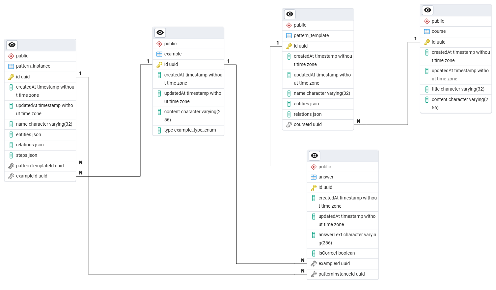

# MPEC service

A **Mathematical Proof Explanatory Chain** service for demo.

## Dependencies

* **@nestjs/swagger** – Generates OpenAPI (Swagger) documentation for all REST APIs, making endpoints self-describing and testable.
* **class-validator** – Declarative validation of request DTOs (e.g., ensuring non-empty strings, valid UUIDs, enums).
* **typeorm** – Object-relational mapper (ORM) for PostgreSQL, handling entities, migrations, and database queries in a TypeScript-friendly way.
* **winston** – A versatile logging library supporting multiple transports (console, file, JSON).

## How to run

Create a `.env` file at root with following content (values are sample):

```ENV
# ========== Docker compose requirements ==========
POSTGRES_USER=admin
POSTGRES_PASSWORD=admin
POSTGRES_DB=mpec
PGADMIN_DEFAULT_EMAIL=admin@mail.com
PGADMIN_DEFAULT_PASSWORD=admin

# ========== Main service requirements ==========
NODE_ENV=development
DATABASE_HOST=postgres
DATABASE_PORT=5432
DATABASE_NAME=mpec
DATABASE_USERNAME=admin
DATABASE_PASSWORD=admin
```

Then run following command:

```bash
docker compose up --build
```

NOTE: Swagger documentation is at `/docs` end-point

## ERD

